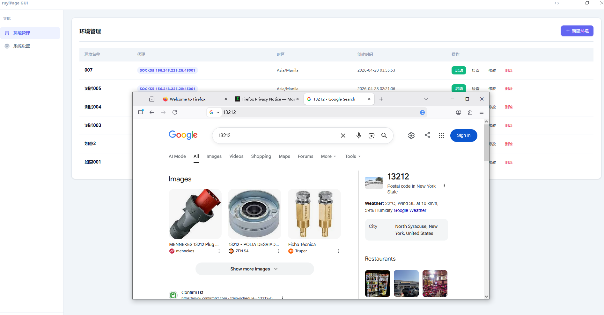
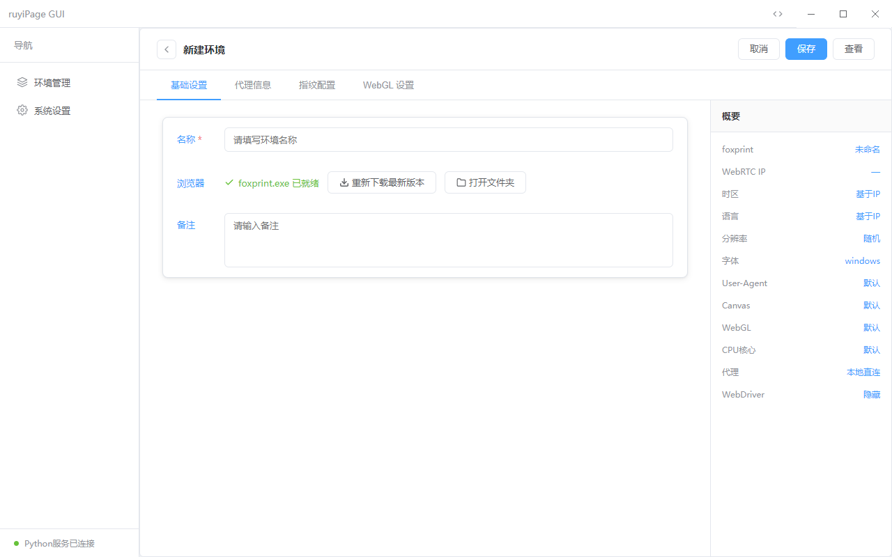
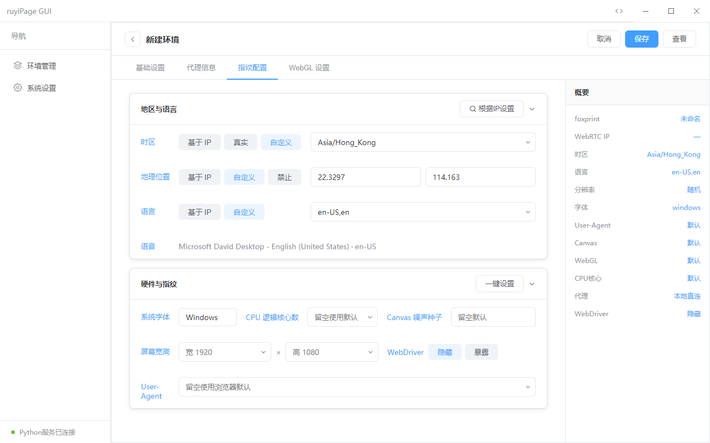
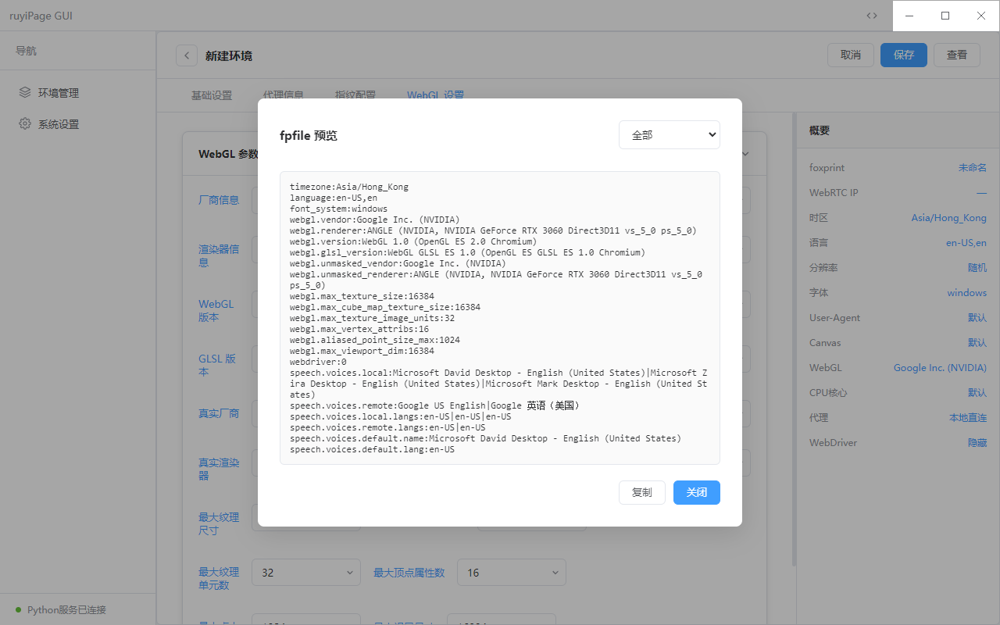

<div align="center">


# ruyiBrowser GUI

**基于 [ruyiPage](https://github.com/LoseNine/ruyipage) 的 Firefox 指纹浏览器图形化管理工具**

[](https://www.electronjs.org/)
[](https://vuejs.org/)
[]()
[](LICENSE)

</div>

---

## 简介

ruyiBrowser GUI 是 [ruyiPage](https://github.com/LoseNine/ruyipage) 指纹浏览器的桌面端管理工具，基于 Electron + Vue3 构建。无需手动配置参数，通过图形界面即可创建、管理、启动多个独立的 Firefox 指纹环境，适用于多账号运营、反检测测试等场景。

> 底层浏览器由 [firefox-fingerprintBrowser](https://github.com/LoseNine/firefox-fingerprintBrowser) 提供，具备指纹隔离、代理绑定、WebRTC 防泄漏等能力。

---

## 界面预览

**环境管理 — 一键启动 Firefox 指纹浏览器**



**新建环境 — 基础设置与配置概要**



**指纹配置 — 地区语言、硬件指纹**



**fpfile 预览 — 保存前实时查看最终指纹文件**



---

## 功能特性

- **多环境管理** — 创建、编辑、删除多个浏览器环境，每个环境独立 Profile
- **指纹配置** — 时区、语言、User-Agent、Canvas 噪声、WebGL、屏幕分辨率、CPU 核心数
- **代理绑定** — 支持 HTTP / SOCKS5 代理，一键测试连通性
- **WebRTC 防泄漏** — 支持禁用 / 替换 / 使用代理 IP 等多种策略
- **根据 IP 自动填充** — 自动查询代理 IP，填充时区、语言、地理位置
- **语音指纹** — 自动根据语言生成对应 speech.* 配置
- **fpfile 预览** — 保存前实时预览最终生成的指纹文件内容，支持分类过滤
- **一键启动** — 直接调用 foxprint.exe 启动对应环境，无需命令行

---

## 快速开始

### 环境要求

- Windows 10/11 x64
- [foxprint](https://github.com/LoseNine/firefox-fingerprintBrowser) 已安装（用于启动指纹浏览器）

### 安装

从 [Releases](https://github.com/jacklaigougou/ruyiBrowser-GUI/releases) 下载最新安装包：

```
ruyiPage GUI Setup x.x.x.exe
```

双击安装，完成后从桌面快捷方式启动。

---

## HTTP 代理说明

### 代理类型支持

- 界面支持 `HTTP` 和 `SOCKS5` 两种代理类型。
- `HTTP` 类型会直接写入 Firefox `network.proxy.http/ssl` 配置并生效。
- `SOCKS5` 类型在部分指纹内核中可能存在原生代理兼容问题，项目已内置本地桥接方案。

### SOCKS5 的桥接机制（无需插件）

当环境选择 `SOCKS5` 并启动时，程序会自动执行：

1. 在本机 `127.0.0.1` 启动一个临时 HTTP 代理端口（随机端口）
2. 浏览器仅连接该本地 HTTP 端口
3. 本地桥接进程再将请求转发到你配置的上游 SOCKS5（含账号密码）

这样可以保持上游仍是 SOCKS5，同时避开部分内核对 SOCKS5 直连的兼容限制。

### 注意事项

- 本地端口仅绑定 `127.0.0.1`，不会对外网开放。
- 代理用户名密码仍使用环境中的 SOCKS5 配置。
- 删除环境或关闭应用后，相关桥接端口会自动清理。

---

## 开发

### 依赖安装

```bash
npm install
```

### 启动开发模式

```bash
npm run dev
```

### 打包

```bash
npm run build
```

输出在 `dist/` 目录。

---

## 项目结构

```
src/
  main/
    main.js              # Electron 主进程 + 所有 IPC handlers
    python-bridge.js     # HTTP 调用 Python 服务
    http/
      ipQuery.js         # IP 地理信息查询
      speechVoiceMap.js  # 语音语言映射表
  preload/
    preload.js           # contextBridge，安全暴露 API 给渲染进程
  renderer/
    views/
      environment/       # 环境管理页（列表、新建、编辑）
      settings/          # 设置页
    components/          # 公共组件
    style.css            # 全局样式
python/
  server.py              # ruyiPage HTTP 桥接服务
assets/
  icon.ico / icon.png    # 应用图标
```

---

## 相关项目

| 项目 | 说明 |
|------|------|
| [ruyiPage](https://github.com/LoseNine/ruyipage) | Python Firefox 自动化框架 |
| [firefox-fingerprintBrowser](https://github.com/LoseNine/firefox-fingerprintBrowser) | Firefox 指纹浏览器内核 |
| [ruyipage-js](https://github.com/GanFish404/ruyipage-js) | JS 实现版本 |
| [ruyipage-go](https://github.com/pll177/ruyipage-go) | Go 实现版本 |

---

<div align="center">

如有问题请提交 [Issue](https://github.com/jacklaigougou/ruyiBrowser-GUI/issues)

</div>
